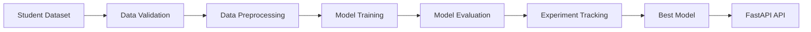

# 🎓 Student Academic Outcome Prediction

A production-oriented machine learning project that predicts whether a student is likely to **Dropout**, **Remain Enrolled**, or **Graduate** using academic, demographic, and socioeconomic data.

The project demonstrates an end-to-end machine learning workflow, from data validation and preprocessing to model training, benchmarking, experiment tracking, and deployment. It follows a modular architecture and incorporates modern MLOps practices such as **DVC**, **MLflow**, **Weights & Biases**, **Optuna**, **GitHub Actions**, **Docker**, and **FastAPI** to build a reproducible and production-ready prediction system. :contentReference[oaicite:0]{index=0}

<p align="center">


</p>

---

## 🚀 Highlights

- 📊 Multi-class prediction (**Dropout**, **Enrolled**, **Graduate**)
- 🏗️ Modular and configuration-driven project architecture
- ⚙️ End-to-end machine learning pipeline
- 📦 Reproducible workflows using **DVC**
- 📈 Experiment tracking with **MLflow** and **Weights & Biases**
- 🎯 Hyperparameter optimization using **Optuna**
- 🧪 Automated testing with **Pytest**
- 🔄 Continuous Integration using **GitHub Actions**
- 🚀 REST API deployment with **FastAPI**
- 🐳 Docker support for consistent deployment

## 📑 Table of Contents

- [Overview](#-overview)
- [Features](#-features)
- [Machine Learning Workflow](#-machine-learning-workflow)
- [Project Highlights](#-project-highlights)
- [Tech Stack](#-tech-stack)
- [Project Structure](#-project-structure)
- [Model Performance](#-model-performance)
- [Documentation](#-documentation)
- [Installation](#-installation)
- [Usage](#-usage)
- [Future Improvements](#-future-improvements)
- [License](#-license)

## 📖 Overview

Student Academic Outcome Prediction is an end-to-end machine learning project that predicts whether a student is likely to **Dropout**, **Remain Enrolled**, or **Graduate** based on academic, demographic, and socioeconomic factors.

The primary objective is to identify students at risk of dropping out early, enabling educational institutions to provide timely interventions such as academic mentoring, financial assistance, counseling, and personalized learning support. :contentReference[oaicite:0]{index=0}

---

## ✨ Features

- 📊 Multi-class student outcome prediction
- 🧹 Automated data validation and preprocessing
- 🤖 Training and benchmarking of multiple ML models
- 🎯 Hyperparameter optimization using **Optuna**
- 📈 Experiment tracking with **MLflow** and **Weights & Biases**
- 📦 Dataset and artifact versioning using **DVC**
- 🏗️ Modular and configuration-driven project architecture
- 🚀 FastAPI-based REST API for inference
- 🧪 Automated testing with **Pytest**
- 🔄 Continuous Integration using **GitHub Actions**
- 🐳 Docker support for reproducible deployment

---

## 🔄 Machine Learning Workflow



The workflow follows a modular pipeline where each stage performs a single responsibility—from validating raw data to deploying the best-performing model for inference. :contentReference[oaicite:1]{index=1}

## 🌟 Project Highlights

| Category | Implementation |
|----------|----------------|
| 🏗️ Architecture | Modular, configuration-driven project structure |
| 🤖 Machine Learning | Multi-class classification for student outcome prediction |
| 📊 Model Development | Benchmarking of multiple machine learning algorithms |
| 🎯 Optimization | Hyperparameter tuning using **Optuna** |
| 📈 Experiment Tracking | **MLflow** and **Weights & Biases (W&B)** |
| 📦 Data Versioning | **DVC** for dataset and artifact versioning |
| 🚀 Deployment | REST API built with **FastAPI** |
| 🧪 Testing | Automated unit testing with **Pytest** |
| 🔄 Continuous Integration | **GitHub Actions** CI pipeline |
| 🐳 Containerization | Docker support |

---

## 🛠️ Tech Stack

| Category | Technologies |
|----------|--------------|
| **Language** | Python |
| **Machine Learning** | Scikit-learn, LightGBM, XGBoost, CatBoost |
| **Data Processing** | Pandas, NumPy |
| **Hyperparameter Optimization** | Optuna |
| **Experiment Tracking** | MLflow, Weights & Biases (W&B) |
| **Data Versioning** | DVC |
| **API Development** | FastAPI |
| **Testing** | Pytest |
| **CI/CD** | GitHub Actions |
| **Containerization** | Docker |
| **Configuration** | YAML |

---

## 📁 Project Structure

```text
Student-Academic-Outcome-Prediction/
│
├── app/                  # FastAPI application
├── artifacts/            # Models and generated artifacts
├── config/               # YAML configuration
├── data/                 # Raw and processed datasets
├── docs/                 # Project documentation
├── notebooks/            # Research & experimentation
├── src/                  # Core machine learning pipeline
├── tests/                # Unit tests
├── utils/                # Helper utilities
│
├── dvc.yaml              # DVC pipeline
├── Dockerfile
├── main.py
└── README.md
```

## 📊 Model Performance

To identify the most suitable production model, six machine learning algorithms were trained and evaluated using the same preprocessing pipeline and evaluation strategy. **Macro F1-Score** was used as the primary evaluation metric due to the imbalanced class distribution.

| Rank | Model | Accuracy | Macro F1 | Status |
|:---:|----------------------|:-------:|:--------:|--------|
| 🥇 | **XGBoost** | **0.7409** | **0.6642** | Finalist |
| 🥈 | **LightGBM** | 0.7409 | 0.6605 | ✅ Production Model |
| 🥉 | **CatBoost** | 0.7369 | 0.6520 | Runner-up |

> [!NOTE]
> Although **XGBoost** achieved the highest Macro F1-Score, **LightGBM** was selected as the production model because it offers an excellent balance between predictive performance, inference speed, and computational efficiency.

➡️ **See the complete benchmarking process:**  
**[Model Benchmark](docs/model_benchmark.md)**

---

## 📚 Documentation

Detailed project documentation is available in the `docs/` directory.

| Document | Description |
|----------|-------------|
| 🏗️ [Project Architecture](docs/project_architecture.md) | Overview of the modular project structure and system design. |
| ⚙️ [MLOps Practices](docs/mlops_practices.md) | MLOps workflow, experiment tracking, DVC, CI, and deployment practices. |
| 📊 [Model Benchmark](docs/model_benchmark.md) | Model comparison, evaluation metrics, and production model selection. |

---

## 🚀 Installation

### 1. Clone the Repository

```bash
git clone https://github.com/ryomen1234/Student-Academic-Outcome-Prediction.git

cd Student-Academic-Outcome-Prediction
```

### 2. Create a Virtual Environment

**Windows**

```bash
python -m venv .venv

.venv\Scripts\activate
```

**Linux / macOS**

```bash
python3 -m venv .venv

source .venv/bin/activate
```

### 3. Install Dependencies

```bash
pip install -r requirements.txt
```

---

## ⚙️ Running the Training Pipeline

Execute the complete machine learning pipeline.

```bash
python -m main
```

This command performs the end-to-end workflow, including data validation, preprocessing, model training, evaluation, and saving the production model.

---

## 🚀 Running the FastAPI Server

Start the REST API for model inference.

```bash
uvicorn app.main:app --reload
```

After the server starts, open the interactive API documentation:

```text
http://127.0.0.1:8000/docs
```

The Swagger UI allows you to test prediction endpoints directly from your browser.

> [!TIP]
> During development, the `--reload` flag automatically reloads the server whenever source files change.

---

## 🎯 Future Improvements

- Cloud-based deployment (AWS / Azure / GCP)
- Remote DVC storage for datasets and artifacts
- End-to-end CI/CD pipeline
- Model monitoring and performance tracking
- Automated model retraining

---

## 📄 License

This project is licensed under the **MIT License**.

See the [LICENSE](LICENSE) file for details.

---

## ⭐ Support

If you found this project useful, consider giving it a ⭐ on GitHub. It helps others discover the project and supports future development.


