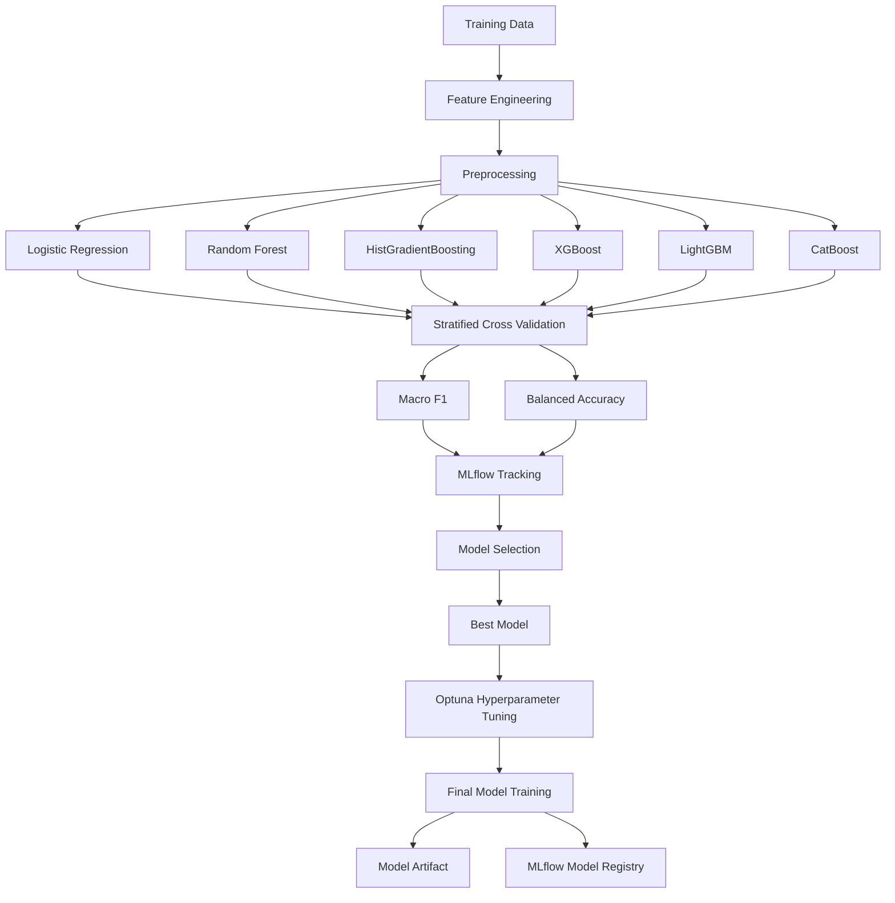
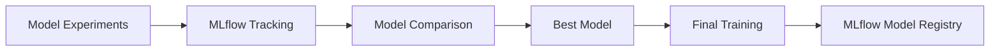
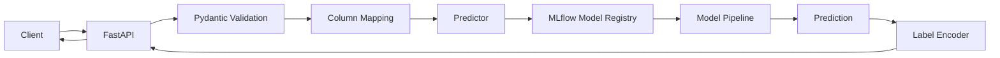

# Student Academic Outcome Prediction

A modular machine learning and MLOps project for predicting student academic outcomes using academic, demographic, and socioeconomic data.

The project addresses a three-class classification problem:

* **Dropout**
* **Enrolled**
* **Graduate**

The broader objective is to support the early identification of students who may be at risk of academic dropout so that appropriate support strategies can be considered.

## Highlights

* Three-class student academic outcome prediction
* Benchmarking of **6 machine learning models**
* **Random Forest selected using Macro F1**
* **Stratified K-Fold cross-validation**
* **Optuna hyperparameter optimization**
* **MLflow experiment tracking and model registry**
* **DagsHub** for remote MLflow infrastructure
* FastAPI inference service
* Pydantic-based API input validation
* MLflow model alias-based model loading
* Dockerized inference service
* **GitHub Actions CI and Continuous Training (CT)**
* Automated tests for data-processing components

## Dataset

The dataset was created from information collected by a higher education institution in Portugal and combines information from several disjoint databases.

Each instance represents one student enrolled in an undergraduate degree program.

The dataset contains academic, demographic, socioeconomic, and academic-performance information.

The target variable contains three classes:

| Class      | Meaning                       |
| ---------- | ----------------------------- |
| `Dropout`  | Student leaves the program    |
| `Enrolled` | Student remains enrolled      |
| `Graduate` | Student completes the program |

The validated dataset contains:

| Property       | Value |
| -------------- | ----: |
| Students       | 4,424 |
| Features       |    37 |
| Missing values |     0 |
| Duplicate rows |     0 |
| Target classes |     3 |

The dataset is supported by the SATDAP - Capacitação da Administração Pública program under grant `POCI-05-5762-FSE-000191`, Portugal.

## Data Preparation

The data pipeline separates validation and cleaning responsibilities.

### Data Validation

The validation stage verifies:

* Dataset structure
* Number of rows and columns
* Missing values
* Duplicate records
* Target column
* Target classes

The validation result for the project dataset is:

```text
Status: PASSED
Rows: 4424
Columns: 37
Missing values: None
Duplicate rows: 0
Target: Target
Classes: Dropout, Enrolled, Graduate
```

### Data Cleaning

The cleaning stage is responsible for:

* Normalizing column names
* Removing configured columns
* Removing duplicate rows
* Returning the cleaned DataFrame

### Data Split

The dataset is split into:

* **80% training**
* **20% testing**

The test dataset is kept separate from model selection and final training and is used for final evaluation.

## Training Pipeline

The training pipeline is modular and separates feature engineering, preprocessing, model comparison, hyperparameter optimization, final training, and model registration.



### Feature Engineering

A dedicated feature-engineering transformer creates additional academic features from the semester information.

The engineered features include:

* Semester 1 approval rate
* Semester 1 evaluation rate
* Semester 1 without-evaluation rate
* Semester 2 approval rate
* Semester 2 evaluation rate
* Semester 2 without-evaluation rate
* Total enrolled units
* Total approved units
* Total evaluations
* Overall approval rate
* Grade change between semesters
* Approval change between semesters
* Enrollment change between semesters

These features provide the model with information about both academic performance and progression.

### Preprocessing

The preprocessing stage uses a configurable `ColumnTransformer` with separate pipelines for:

* Numerical features
* Categorical features
* Binary features

Numerical features support configurable imputation and scaling.

Categorical features support configurable imputation and encoding.

The feature engineering, preprocessing, and classifier are combined into a single machine learning pipeline.

```text
Input Data
    |
    v
Feature Engineering
    |
    v
Preprocessing
    |
    v
Classifier
```

This ensures that the same transformation pipeline is reused during model training and inference.

## Model Development

Six classification algorithms are benchmarked using the same pipeline and cross-validation strategy:

* Logistic Regression
* Random Forest
* HistGradientBoosting
* XGBoost
* LightGBM
* CatBoost

Because the target classes are imbalanced, **Macro F1** is used as the primary model-selection metric.

**Balanced Accuracy** is used as an additional evaluation metric.

### Cross-Validation

Candidate models are evaluated using **Stratified K-Fold Cross-Validation**.

The evaluation records:

* Mean Macro F1
* Standard deviation of Macro F1
* Mean Balanced Accuracy
* Standard deviation of Balanced Accuracy

The model-selection process ranks candidates by mean Macro F1.

## Model Benchmark Results

| Rank | Model                | Macro F1 Mean | Macro F1 Std | Balanced Accuracy Mean | Balanced Accuracy Std |
| ---: | -------------------- | ------------: | -----------: | ---------------------: | --------------------: |
|    1 | **Random Forest**    |    **0.7165** |       0.0232 |                 0.7113 |                0.0231 |
|    2 | HistGradientBoosting |        0.7110 |       0.0168 |                 0.7031 |                0.0168 |
|    3 | Logistic Regression  |        0.7095 |       0.0145 |             **0.7169** |                0.0155 |
|    4 | XGBoost              |        0.7070 |       0.0202 |                 0.6990 |                0.0185 |
|    5 | LightGBM             |        0.7068 |       0.0140 |                 0.6988 |                0.0141 |
|    6 | CatBoost             |        0.6967 |       0.0122 |                 0.6881 |                0.0104 |

### Model Selection Decision

Random Forest achieved the highest mean Macro F1:

```text
Random Forest
Macro F1 = 0.7165
```

Although Logistic Regression achieved a slightly higher Balanced Accuracy, Macro F1 was defined as the primary model-selection metric.

Therefore, **Random Forest was selected as the best candidate model**.

## Hyperparameter Optimization

After model selection, the selected Random Forest model is passed to the hyperparameter optimization stage.

**Optuna** is used to search for better model parameters.

The optimized parameters are then applied to the selected pipeline before final training.

The training pipeline follows:

```text
Candidate Models
       |
       v
Cross-Validation
       |
       v
Select Best Model
       |
       v
Optuna Optimization
       |
       v
Best Parameters
       |
       v
Final Model Training
```

## Experiment Tracking and Model Registry

**MLflow** is used for experiment tracking and model management.

During model benchmarking, the evaluation results of candidate models are logged so that model-selection decisions are traceable.

The final trained model is registered in the MLflow Model Registry.



**DagsHub** provides the remote MLflow infrastructure used by the project.

## Final Model Evaluation

The final model is evaluated against the untouched test dataset.

The test dataset contains **885 records**.

### Overall Results

| Metric            |      Score |
| ----------------- | ---------: |
| Accuracy          | **0.7537** |
| Macro F1          | **0.7077** |
| Balanced Accuracy | **0.7121** |
| Macro Precision   | **0.7104** |
| Macro Recall      | **0.7121** |

### Class-Level Results

| Class    | Precision | Recall | F1-Score | Support |
| -------- | --------: | -----: | -------: | ------: |
| Dropout  |    0.8226 | 0.7183 |   0.7669 |     284 |
| Enrolled |    0.4577 | 0.5786 |   0.5111 |     159 |
| Graduate |    0.8509 | 0.8394 |   0.8451 |     442 |

The model performs strongest on the `Graduate` class and has the most difficulty distinguishing the `Enrolled` class.

The `Dropout` class achieves an F1-score of **0.7669** and recall of **0.7183**.

### Confusion Matrix

```text
                  Predicted
               Dropout  Enrolled  Graduate

Actual Dropout    204       52        28
Actual Enrolled    30       92        37
Actual Graduate    14       57       371
```

## Inference Architecture

The trained model is exposed through a FastAPI inference service.

The inference service loads the registered model from MLflow using a configured model alias.



### API Input Validation

The prediction request is defined using a Pydantic schema.

Unexpected fields are rejected using strict request validation.

The API accepts student attributes including:

* Academic information
* Demographic information
* Socioeconomic information
* First-semester academic information
* Second-semester academic information
* Macroeconomic indicators

### Column Mapping

The API uses clean Python-friendly field names and maps them to the original dataset column names before prediction.

For example:

```text
age_at_enrollment
        |
        v
Age at enrollment
```

This keeps the API interface clean while maintaining compatibility with the trained model pipeline.

### Model Loading

The inference service constructs the MLflow model URI using the registered model name and alias:

```text
models:/<model_name>@<model_alias>
```

The model is loaded when the application initializes rather than being loaded for every prediction request.

### Prediction Flow

```text
HTTP POST /predict
        |
        v
Pydantic Validation
        |
        v
Column Mapping
        |
        v
Pandas DataFrame
        |
        v
Predictor
        |
        v
MLflow Model
        |
        v
Feature Engineering
        |
        v
Preprocessing
        |
        v
Random Forest
        |
        v
Label Encoder
        |
        v
Dropout / Enrolled / Graduate
```

### Health Check

The API exposes a health endpoint that reports:

* Service status
* Registered model name
* Model alias

## Docker

Docker is used to package the FastAPI inference service and its runtime dependencies.

The container provides a reproducible inference environment containing:

* Python runtime
* FastAPI
* Model dependencies
* Application source
* Configuration
* Model artifacts

Build the image:

```bash
uv run docker build -t student-success-api .
```

Run the container:

```bash
uv run docker run --name student-success-api -p 8000:8000 student-success-api
```

The API is available at:

```text
http://localhost:8000
```

Swagger UI:

```text
http://localhost:8000/docs
```

## MLOps Practices

| Practice                    | Implementation                            |
| --------------------------- | ----------------------------------------- |
| Configuration               | YAML + Pydantic                           |
| Data validation             | Custom validation pipeline                |
| Data cleaning               | Dedicated cleaning component              |
| Feature engineering         | Custom scikit-learn transformer           |
| Preprocessing               | scikit-learn Pipeline + ColumnTransformer |
| Model benchmarking          | 6 classification models                   |
| Cross-validation            | Stratified K-Fold                         |
| Model selection             | Macro F1                                  |
| Hyperparameter optimization | Optuna                                    |
| Experiment tracking         | MLflow                                    |
| Model registry              | MLflow Model Registry                     |
| Remote ML infrastructure    | DagsHub                                   |
| Testing                     | Pytest                                    |
| Continuous Integration      | GitHub Actions                            |
| Continuous Training         | GitHub Actions                            |
| API                         | FastAPI                                   |
| Input validation            | Pydantic                                  |
| Containerization            | Docker                                    |

## CI and Continuous Training

GitHub Actions is used to automate parts of the machine learning development lifecycle.

### Continuous Integration

CI runs automated tests to verify the data-processing components of the project.

Current tests cover:

* Data validation
* Missing-value and duplicate detection
* Target-label validation
* Data cleaning
* Configured column removal
* Column-name normalization
* Train/test splitting
* Split reproducibility

Run the tests locally with:

```bash
pytest tests/ -v
```

### Continuous Training

Continuous Training is implemented using GitHub Actions to automate the training workflow.

The CT workflow can execute the project's training process after the configured workflow trigger, allowing model training to be integrated into the development lifecycle rather than requiring manual execution alone.

The training workflow includes the project's existing:

```text
Data
  |
  v
Validation / Cleaning
  |
  v
Feature Engineering
  |
  v
Preprocessing
  |
  v
Model Benchmarking
  |
  v
Model Selection
  |
  v
Hyperparameter Optimization
  |
  v
Final Training
  |
  v
MLflow Model Registry
```

## DVC Pipeline

DVC is used for data and pipeline versioning.

The project contains DVC pipeline stages for the data, training, and evaluation workflow.

Run the pipeline with:

```bash
dvc repro
```

Key generated artifacts include the trained model and evaluation outputs configured by the project.

## Project Structure

```text
Student-Academic-Outcome-Prediction/

├── .github/              # GitHub Actions CI / CT workflows
├── .dvc/                 # DVC metadata
├── app/                  # FastAPI application
├── artifacts/            # Models and generated artifacts
├── config/               # YAML configuration
├── data/                 # Raw and processed data
├── docs/                 # Detailed documentation
├── entity/               # Configuration entities
├── notebooks/            # Model experimentation
├── src/                  # Data, training, evaluation, inference
├── tests/                # Automated tests
├── utils/                # Shared utilities
├── Dockerfile
├── dvc.yaml
├── dvc.lock
├── main.py
├── pytest.ini
├── requirements.txt
└── README.md
```

## Installation

### 2. Install `uv`

If `uv` is not already installed, install it using the official installation method for your operating system.

Verify the installation:

```bash
uv --version
```

### 2. Create a virtual environment

**Windows**

```bash
uv venv
.venv/Scripts/Activate.ps1
```

**Linux / macOS**

```bash
uv venv
source .venv/bin/activate
```

### 3. Install dependencies

```bash
uv sync
```

## Training

Run the main training pipeline:

```bash
uv run python -m main
```

The training pipeline:

1. Loads the training data.
2. Creates candidate model pipelines.
3. Performs stratified cross-validation.
4. Compares models using Macro F1 and Balanced Accuracy.
5. Selects the model with the highest Macro F1.
6. Performs Optuna hyperparameter optimization for the selected Random Forest.
7. Trains the final model on the training dataset.
8. Saves the final model artifact.
9. Saves model comparison results.
10. Registers the final model with MLflow.

## FastAPI Inference

Start the API locally:

```bash
uv run uvicorn src.api.app:app --host 0.0.0.0 --port 8000
```

For development:

```bash
uv run uvicorn src.api.app:app --reload
```

Open the interactive API documentation:

```text
http://localhost:8000/docs
```

### Health Check

```bash
curl http://localhost:8000/health
```

### Prediction

The prediction API accepts a validated student prediction request.

The API validates the input, maps API fields to the original dataset columns, sends the data through the registered model pipeline, and returns the predicted academic outcome.

Example response:

```json
{
  "prediction": "Graduate",
  "model": "student-model",
  "model_alias": "champion"
}
```

## Limitations

* Prediction quality depends on the available student features and dataset.
* The `Enrolled` class has substantially lower predictive performance than the `Dropout` and `Graduate` classes.
* Testing currently focuses primarily on data-processing components.
* Broader model/API integration tests can be added.
* Model monitoring is not implemented.
* Kubernetes deployment is not implemented.
* Automated production retraining and deployment are not implemented.

## Future Improvements

* Expand model and API integration tests
* Add model monitoring
* Add production cloud deployment
* Introduce Kubernetes deployment
* Improve model and artifact lifecycle management
* Extend automated retraining and deployment workflows

## Documentation

Additional project documentation is available in [`docs/`](docs/).

Suggested documentation sections include:

* Data and Problem Statement
* Training Pipeline
* Model Benchmark
* Final Model Evaluation
* Inference Architecture
* MLOps Practices
* Docker Documentation
* API Documentation
* Project Architecture

## License

This project is licensed under the MIT License. See [`LICENSE`](LICENSE) for details.
