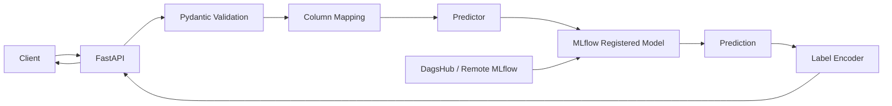
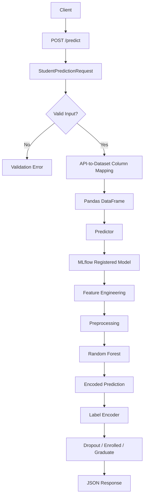

# 3. Inference Architecture

## 3.1 Overview

The inference system exposes the trained student academic-outcome model through a REST API.

The system accepts student information as a JSON request and returns a predicted academic outcome:

* `Dropout`
* `Enrolled`
* `Graduate`

The inference service is implemented using **FastAPI** and retrieves the registered model from **MLflow Model Registry** using a model alias.

The high-level architecture is:



---

# 3.2 Application Startup

The model is initialized when the FastAPI application starts.

The application first loads environment variables and configuration, then creates a `Predictor` instance using:

* MLflow tracking URI
* Registered model name
* Model alias
* Label encoder path

This initialization occurs at application level rather than inside the `/predict` endpoint.

The startup flow is therefore:

```text
FastAPI Application Starts
          |
          v
Load Configuration
          |
          v
Load MLflow Configuration
          |
          v
Create Predictor
          |
          v
Load Registered Model
          |
          v
Load Label Encoder
          |
          v
API Ready
```

### Why load the model at startup?

Loading the model for every prediction request would introduce unnecessary model-loading overhead.

Instead, the model is loaded once and kept in memory by the `Predictor` instance.

This allows subsequent prediction requests to directly use the already-loaded model.

---

# 3.3 MLflow Model Loading

The `Predictor` configures MLflow using the configured tracking URI and constructs the model URI using the registered model name and model alias:

```text
models:/<model_name>@<model_alias>
```

The model is then loaded using MLflow's Python model interface.

Conceptually:

```text
MLflow Tracking URI
        |
        v
Registered Model
        |
        v
Model Alias
        |
        v
models:/model@alias
        |
        v
MLflow Model
        |
        v
Loaded into Predictor
```

### Why use a model alias?

The API does not need to know a specific model version number.

Instead, it references a logical model alias.

For example:

```text
models:/student-model@champion
```

The alias can point to the desired model version in the registry without requiring the inference application code to change.

This creates a separation between:

* **Application code**
* **Model version management**

---

# 3.4 Authentication and Configuration

The FastAPI application obtains MLflow-related credentials from environment variables.

The application checks for:

* `MLFLOW_TRACKING_USERNAME`
* `DAGSHUB_USER_TOKEN`

and raises an error if the required environment variables are not configured.

This keeps authentication information outside the application source code.

The inference application therefore follows:

```text
Environment Variables
        |
        v
Authentication Configuration
        |
        v
MLflow / DagsHub
```

This is preferable to hardcoding credentials inside the Python application.

---

# 3.5 API Input Validation

The prediction endpoint accepts a `StudentPredictionRequest` Pydantic model.

The request schema defines the expected student attributes, including:

* Demographic information
* Academic background
* Admission information
* Socio-economic attributes
* First-semester academic information
* Second-semester academic information
* Macroeconomic indicators

The schema contains the same 37 input attributes represented by the dataset's feature set.

The request model also uses:

```text
extra = "forbid"
```

This means fields that are not explicitly defined in the request schema are rejected.

### Why use strict input validation?

Without request validation, malformed or unexpected input could reach the model.

Pydantic provides a clear boundary:

```text
Incoming JSON
     |
     v
Pydantic Schema
     |
     +---- Invalid --> Reject Request
     |
     v
Valid Student Data
```

This makes the API contract explicit and prevents unexpected fields from silently entering the inference pipeline.

---

# 3.6 API-to-Dataset Column Mapping

The API uses user-friendly Python field names, while the trained model expects the original dataset column names.

A dedicated `COLUMN_MAPPING` dictionary translates between these two representations.

For example:

```text
API field
age_at_enrollment
       |
       v
Dataset column
Age at enrollment
```

Similarly:

```text
curricular_units_1st_sem_approved
       |
       v
Curricular units 1st sem (approved)
```

The mapping covers the student demographic, academic, and economic attributes required by the model.

### Why separate API names from dataset names?

Dataset column names are often not ideal as API field names because they can contain:

* Spaces
* Parentheses
* Special characters
* Long descriptive names

Using Python-friendly field names produces a cleaner API while preserving compatibility with the trained model.

---

# 3.7 Prediction Request Flow

The `/predict` endpoint follows the following sequence:

```text
HTTP POST /predict
        |
        v
StudentPredictionRequest
        |
        v
Pydantic Validation
        |
        v
model_dump()
        |
        v
Column Mapping
        |
        v
Pandas DataFrame
        |
        v
Predictor.predict()
        |
        v
MLflow Model
        |
        v
Numeric Prediction
        |
        v
Label Encoder
        |
        v
Academic Outcome
```

The API converts the validated request into a dictionary, maps the API fields to the original dataset column names, and constructs a single-row pandas DataFrame.

---

# 3.8 Model Prediction

The `Predictor` receives the DataFrame and calls the loaded MLflow model's `predict()` method.

The important architectural decision is that the API does **not manually perform feature engineering or preprocessing**.

The trained model is the complete pipeline created during training:

```text
Input Data
    |
    v
Feature Engineering
    |
    v
Preprocessing
    |
    v
Random Forest Model
    |
    v
Encoded Prediction
```

The same pipeline that was created during training is therefore reused during inference.

This reduces the possibility of training-serving skew caused by implementing preprocessing twice.

---

# 3.9 Label Decoding

The model prediction is converted back to the original class label using a separately stored label encoder.

The `Predictor` loads the encoder when it is initialized and applies `inverse_transform()` to the model prediction.

The flow is:

```text
Model Output
     |
     v
Encoded Class
     |
     v
Label Encoder
     |
     v
Dropout / Enrolled / Graduate
```

For example:

```text
Encoded prediction
       |
       v
Label Encoder
       |
       v
"Graduate"
```

This ensures that the API returns a human-readable academic outcome rather than the internal encoded representation.

---

# 3.10 Prediction Response

The `/predict` endpoint returns:

* The predicted class
* Registered model name
* Model alias

The response therefore provides both the prediction and information about which registered model configuration produced it.

Conceptually:

```json
{
    "prediction": "Graduate",
    "model": "student-model",
    "model_alias": "champion"
}
```

This makes the response more traceable because the consumer can identify the model and alias associated with the prediction.

---

# 3.11 Health Endpoint

The service provides a `/health` endpoint.

The endpoint returns:

* Service status
* Registered model name
* Model alias

Conceptually:

```json
{
    "status": "healthy",
    "model": "student-model",
    "model_alias": "champion"
}
```

### Purpose

The health endpoint provides a simple way to verify that the API is running and exposes the model configuration currently used by the service.

It can also be used by deployment or operational tooling as a basic service-health check.

---

# 3.12 Complete Inference Architecture

The complete architecture is:



The model itself therefore remains responsible for the machine-learning transformation and prediction, while FastAPI is responsible for the application/API boundary.

---

# 3.13 Separation of Responsibilities

The inference system follows a clear separation of responsibilities.

| Component      | Responsibility                                        |
| -------------- | ----------------------------------------------------- |
| `app.py`       | FastAPI application and API endpoints                 |
| `schemas.py`   | Request validation and API contract                   |
| `mappings.py`  | API field → dataset column mapping                    |
| `predictor.py` | Model loading and prediction                          |
| MLflow         | Registered model management                           |
| Model pipeline | Feature engineering, preprocessing and classification |
| Label encoder  | Numeric prediction → class name                       |
| DagsHub        | Remote MLflow infrastructure                          |
| Docker         | Runtime packaging and deployment                      |

This modular structure prevents the API layer from becoming tightly coupled to the machine-learning implementation.

---

# 3.14 Design Decisions

## Decision 1: Load the Model Once

**Problem:** Loading a model repeatedly for every request introduces unnecessary overhead.

**Decision:** Initialize the `Predictor` when the FastAPI application is initialized.

**Result:** The model is loaded once and reused for prediction requests.

---

## Decision 2: Use MLflow Model Aliases

**Problem:** Hardcoding a specific model version into the API makes model updates require application changes.

**Decision:** Load the model using:

```text
models:/<model_name>@<alias>
```

**Result:** The registry controls which model version the alias points to, while the API continues using the same model reference.

---

## Decision 3: Strict Request Schema

**Problem:** Unexpected or malformed input can lead to invalid predictions.

**Decision:** Use Pydantic with `extra="forbid"`.

**Result:** The API accepts only explicitly defined student attributes.

---

## Decision 4: Separate API Names from Dataset Names

**Problem:** Original dataset column names contain spaces and other characters that are inconvenient for an API.

**Decision:** Use clean API field names and translate them through `COLUMN_MAPPING`.

**Result:** The API remains easy to consume while the model receives the column names expected by the trained pipeline.

---

## Decision 5: Reuse the Trained Pipeline

**Problem:** Reimplementing feature engineering and preprocessing inside the API could produce differences between training and inference.

**Decision:** Store feature engineering, preprocessing, and the classifier together in the trained pipeline.

**Result:** The same transformation logic is reused during prediction.

---

## Decision 6: Decode Predictions Before Returning Them

**Problem:** The classifier operates using encoded target values.

**Decision:** Store and load the label encoder alongside the model.

**Result:** The API returns meaningful labels such as `Dropout`, `Enrolled`, and `Graduate` rather than encoded values.

---

# 3.15 Tools Used

| Tool         | Purpose                         | Why                                                     |
| ------------ | ------------------------------- | ------------------------------------------------------- |
| **FastAPI**  | REST inference API              | Provides a lightweight Python API layer                 |
| **Pydantic** | Request validation              | Provides a strict and explicit input schema             |
| **Pandas**   | Request-to-DataFrame conversion | Matches the tabular model input format                  |
| **MLflow**   | Model loading and registry      | Provides versioned model management                     |
| **DagsHub**  | Remote MLflow infrastructure    | Provides remote access to ML experiment/model resources |
| **Uvicorn**  | ASGI server                     | Runs the FastAPI application                            |
| **Docker**   | Application containerization    | Provides a reproducible runtime environment             |
| **Python**   | Application and ML runtime      | Integrates the API and model pipeline                   |

---

# 3.16 End-to-End Training to Inference Flow

The complete lifecycle of the project is:


The model registry acts as the connection between the training and inference systems.

The training system produces and registers the model, while the inference system consumes the registered model through its configured alias.

---

# 3.17 Final Architecture

The final system can be summarized as:

```text
                    TRAINING
                       |
                       v
              Training Pipeline
                       |
                       v
                Final Model
                       |
                       v
              MLflow Registry
                       |
                       | model alias
                       v
                 INFERENCE
                       |
                 +-----+-----+
                 |           |
                 v           v
            FastAPI      Predictor
                 |           |
                 |           v
                 |      MLflow Model
                 |           |
                 +-----<-----+
                 |
                 v
               Client
```

The core architectural principle is:

> **Training produces a versioned model artifact, while inference consumes the registered model through a stable API interface.**

This separation allows the model development and model serving lifecycles to evolve independently while maintaining a consistent prediction interface.
