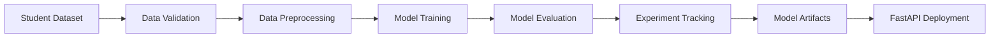
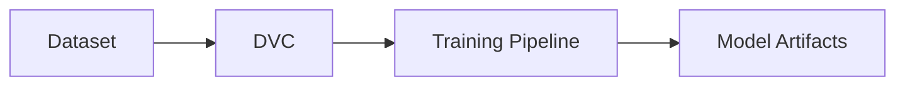
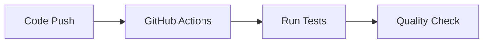

# MLOps Practices

## Overview

This project applies modern MLOps practices to build a reproducible, modular, and production-oriented machine learning pipeline. The workflow emphasizes version control, experiment tracking, automated validation, and deployment while keeping the codebase maintainable and scalable.

---

## MLOps Workflow



---

# Implemented MLOps Practices

## Configuration-Driven Development

The pipeline is driven by YAML configuration files rather than hardcoded values, allowing experiments to be reproduced without modifying source code.

**Benefits**

- Centralized configuration
- Easier experimentation
- Improved reproducibility
- Cleaner codebase

---

## Modular Project Architecture

The project follows a modular architecture where each component has a single responsibility.

```text
src/
config/
data/
artifacts/
app/
tests/
utils/
```

This separation simplifies maintenance, testing, and future development.

---

## Data & Artifact Versioning

The project uses **DVC** to version datasets and machine learning artifacts.



**Benefits**

- Reproducible datasets
- Versioned model artifacts
- Consistent training pipeline

---

## Experiment Tracking

Training experiments are tracked using:

- Weights & Biases (W&B)
- MLflow

Each experiment records:

- Hyperparameters
- Evaluation metrics
- Model artifacts
- Training configuration

This enables objective comparison between different training runs.

---

## Model Benchmarking

Multiple machine learning algorithms are evaluated using the same preprocessing pipeline and evaluation metrics before selecting the production model.

This ensures that model selection is based on measurable performance rather than assumptions.

---

## Continuous Integration

GitHub Actions automatically validates the project whenever new code is pushed.



Automated testing helps maintain code quality throughout development.

---

## Deployment

The trained model is prepared for production using:

- FastAPI REST API
- Streamlit Web Application
- Docker

These components provide a consistent environment for serving predictions.

---

# MLOps Stack

| Area | Technology |
|------|------------|
| Version Control | Git, GitHub |
| Configuration | YAML |
| Data Versioning | DVC |
| Experiment Tracking | W&B, MLflow |
| Hyperparameter Optimization | Optuna |
| Testing | Pytest |
| CI | GitHub Actions |
| Deployment | FastAPI, Streamlit |
| Containerization | Docker |

---

# MLOps Capabilities

- ✅ Modular project architecture
- ✅ Configuration-driven pipeline
- ✅ Data validation
- ✅ Data versioning with DVC
- ✅ Artifact versioning
- ✅ Experiment tracking
- ✅ Hyperparameter optimization
- ✅ Model benchmarking
- ✅ Automated testing
- ✅ Continuous Integration
- ✅ REST API deployment
- ✅ Docker support

---

> [!NOTE]
> This project demonstrates core MLOps practices by combining reproducible pipelines, version-controlled data, experiment tracking, automated testing, and deployment into a maintainable machine learning workflow.