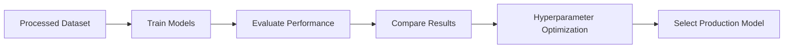

# Model Benchmark

## Overview

To identify the most suitable production model, multiple machine learning algorithms were evaluated using the same dataset, preprocessing pipeline, and evaluation strategy. This ensured a fair comparison and enabled objective model selection based on consistent performance metrics.

---

## Benchmark Workflow

---

## Models Evaluated

The following supervised learning algorithms were benchmarked.

| Model | Description |
|-------|-------------|
| Logistic Regression | Linear baseline classifier |
| Random Forest | Bagging-based decision tree ensemble |
| Extra Trees | Randomized tree ensemble |
| XGBoost | Gradient boosting framework |
| LightGBM | Histogram-based gradient boosting |
| CatBoost | Gradient boosting with categorical feature support |

All models were trained using the same preprocessing pipeline and evaluated under identical conditions.

---

## Evaluation Metrics

Model performance was evaluated using multiple classification metrics.

| Metric | Purpose |
|---------|---------|
| Accuracy | Overall prediction accuracy |
| Balanced Accuracy | Handles class imbalance by averaging recall |
| Macro F1-Score | Equal importance to all target classes |

> [!IMPORTANT]
> **Macro F1-Score** was used as the primary model selection metric because the dataset contains an imbalanced distribution of **Dropout**, **Enrolled**, and **Graduate** classes.

---

## Benchmark Results

| Rank | Model               |  Accuracy  | Balanced Accuracy |  Macro F1  | Training Time (s) |
| :--: | ------------------- | :--------: | :---------------: | :--------: | ----------------: |
|  🥇  | **XGBoost**         | **0.7409** |     **0.6567**    | **0.6642** |              1.06 |
|  🥈  | **LightGBM**        |   0.7409   |       0.6540      |   0.6605   |              7.96 |
|  🥉  | **CatBoost**        |   0.7369   |       0.6458      |   0.6520   |             19.55 |
|   4  | Random Forest       | **0.7420** |       0.6432      |   0.6502   |          **0.87** |
|   5  | Extra Trees         |   0.7279   |       0.6250      |   0.6323   |          **0.80** |
|   6  | Logistic Regression |   0.6878   |       0.5673      |   0.5567   |              1.27 |

---

## Hyperparameter Optimization

Following the model benchmark, **XGBoost** was selected for hyperparameter optimization using **Optuna**.

| Model | Best Macro F1 (CV) | Best Trial | Status |
|---|:---:|:---:|---|
| **XGBoost** | **0.6807** | **75** | **Selected** |

The optimized XGBoost parameters are stored and reused by the main training pipeline.

---

## Model Selection

**XGBoost** is the current model used by the main training and inference pipeline.

It achieved the highest **Macro F1-Score (0.6642)** and **Balanced Accuracy (0.6567)** in the initial benchmark of six models. XGBoost was then further optimized using Optuna, achieving a best cross-validation Macro F1 of **0.6807**.

### Selection Criteria

- Highest benchmark Macro F1-Score
- Highest benchmark Balanced Accuracy
- Further optimization using Optuna
- Optimized parameters reused by the main training pipeline
- Suitable for the current inference pipeline

---

## Benchmark Summary

| Category | Result |
|---|---|
| Models Evaluated | 6 |
| Primary Metric | Macro F1-Score |
| Hyperparameter Optimization | Optuna |
| Fine-Tuned Model | **XGBoost** |
| Best Optuna Trial | **75** |
| Best CV Macro F1 | **0.6807** |
| Current Model | **XGBoost** |

---

## Key Takeaways

- Benchmarked **6** machine learning algorithms using a consistent evaluation pipeline.
- Used **Macro F1-Score** as the primary model-selection metric.
- Selected **XGBoost** based on the benchmark results.
- Fine-tuned **XGBoost only** using Optuna.
- Achieved a best cross-validation Macro F1 of **0.6807** during optimization.
- Reused the optimized XGBoost parameters in the main training pipeline.

> [!NOTE]
> The `0.6807` score is the best cross-validation score obtained during Optuna optimization. It is not the final held-out test-set score.