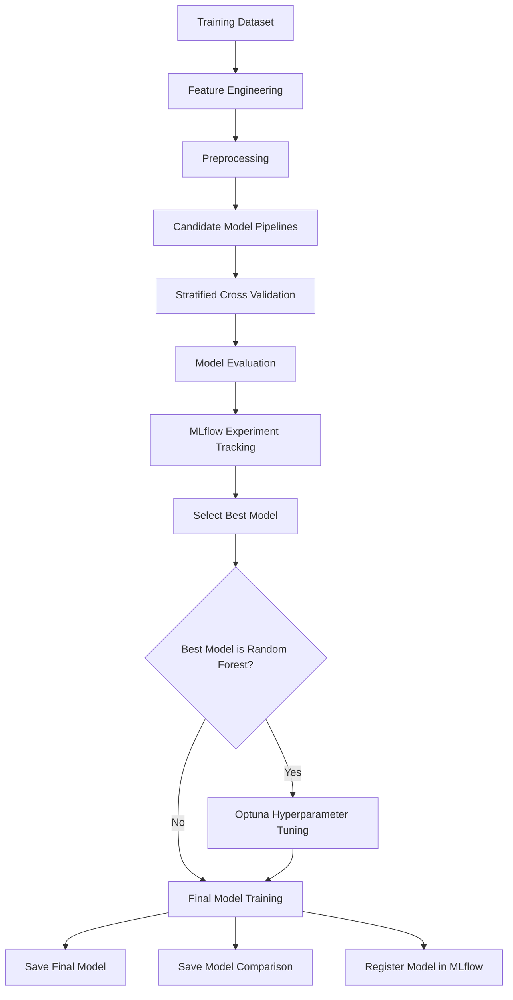
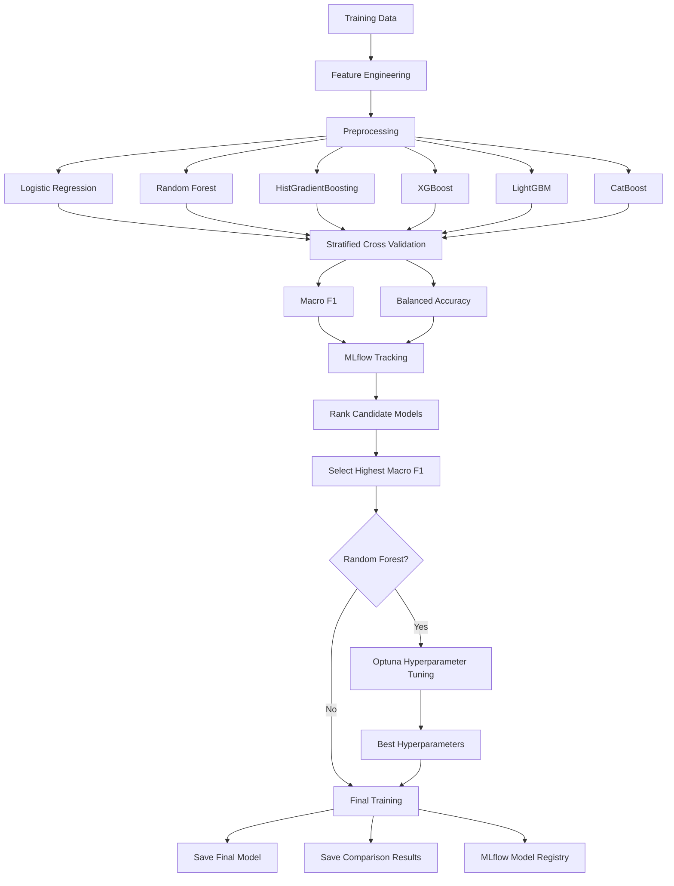

# 2. Training Pipeline

## 2.1 Training Objective

The objective of the training pipeline is to develop a multiclass classification model capable of predicting the academic outcome of a student:

* `Dropout`
* `Enrolled`
* `Graduate`

The training pipeline is designed as a modular sequence of stages rather than a single training script. Each stage has a specific responsibility, including feature engineering, preprocessing, model comparison, hyperparameter tuning, final model training, experiment tracking, and model registration.

The overall training process is:



The main training pipeline orchestrates these stages and initializes MLflow before model experimentation begins.

---

# 2.2 Training Pipeline Architecture

The training system follows a **pipeline-based architecture**.

Instead of preprocessing the data separately and then passing the transformed data to different models, feature engineering, preprocessing, and the model are combined into a single scikit-learn `Pipeline`.

Each candidate model therefore follows the same transformation process:

```text
Input Data
    |
    v
Feature Engineering
    |
    v
Preprocessing
    |
    v
Model
```

The pipeline builder explicitly creates these three stages:

1. `feature_engineering`
2. `preprocessor`
3. `model`

This structure is implemented using scikit-learn's `Pipeline`.

### Why use a pipeline?

The main reason is to keep feature transformations and model training together.

This provides several advantages:

* The same transformations are applied during training and inference.
* Different models can be evaluated using the same feature-processing logic.
* Preprocessing steps are fitted only on the training data during cross-validation.
* The complete transformation and model can be saved as one artifact.
* It reduces the risk of applying different preprocessing logic during inference.

This is particularly important for an inference system because the model artifact contains the transformations required before prediction.

---

# 2.3 Feature Engineering

A dedicated `StudentFeatureEngineer` transformer is used to create additional academic features from the original student attributes.

The feature engineering focuses on four groups of information:

### Semester 1 features

The pipeline creates:

* Semester 1 approval rate
* Semester 1 evaluation rate
* Semester 1 without-evaluation rate

These are calculated relative to the number of enrolled curricular units.

### Semester 2 features

Equivalent features are created for the second semester:

* Semester 2 approval rate
* Semester 2 evaluation rate
* Semester 2 without-evaluation rate

### Overall academic features

The pipeline also calculates:

* Total enrolled units
* Total approved units
* Total evaluations
* Overall approval rate

### Academic progression

To capture changes between semesters, the pipeline creates:

* `grade_change`
* `approval_change`
* `enrollment_change`

These features attempt to represent not only the student's academic performance but also **how that performance changes over time**.

For example:

```text
Semester 1 Grade
       |
       v
Semester 2 Grade
       |
       v
   grade_change
```

This provides the model with an explicit representation of academic progression rather than requiring the model to infer the change from two independent columns.

The feature engineering stage also replaces infinite values resulting from invalid mathematical operations with missing values.

---

# 2.4 Preprocessing

After feature engineering, the data enters a configurable preprocessing pipeline.

The preprocessing logic separates features into three groups:

* Numerical features
* Categorical features
* Binary features

A `ColumnTransformer` is used to apply the appropriate transformation to each group.

### Numerical features

The numerical pipeline consists of:

```text
Numerical Features
       |
       v
Imputation
       |
       v
Scaling
```

The imputation strategy and scaler are configurable.

Supported scaling options are:

* StandardScaler
* MinMaxScaler
* RobustScaler
* No scaling

### Categorical features

Categorical features follow:

```text
Categorical Features
       |
       v
Imputation
       |
       v
Encoding
```

Two encoding strategies are supported:

* One-hot encoding
* Ordinal encoding

### Binary features

Binary features have a separate pipeline containing the configured imputation step.

The three pipelines are combined using a `ColumnTransformer`, with unconfigured columns dropped.

### Design decision

The preprocessing configuration is kept separate from the model implementation.

This allows preprocessing behavior to be changed through configuration rather than rewriting the model code.

---

# 2.5 Candidate Model Selection

Instead of assuming that a single algorithm is optimal for the dataset, the training pipeline evaluates multiple candidate models.

The current candidate set contains:

| Model                | Configuration relevant to training             |
| -------------------- | ---------------------------------------------- |
| Logistic Regression  | `max_iter=1000`, `class_weight="balanced"`     |
| Random Forest        | 300 estimators, `class_weight="balanced"`      |
| HistGradientBoosting | Random state 42                                |
| XGBoost              | 300 estimators, multiclass log-loss evaluation |
| LightGBM             | 300 estimators                                 |
| CatBoost             | 300 iterations                                 |

These candidates are created by the model factory.

### Why multiple models?

The dataset contains a mixture of numerical, categorical, binary, and engineered academic features. Different algorithms can learn different types of relationships from these features.

Rather than making an assumption about which algorithm will perform best, the project uses empirical evaluation to select the strongest candidate.

---

# 2.6 Handling Class Imbalance

Class imbalance is an important characteristic of this problem.

The model factory explicitly addresses this for some candidate models.

For example:

* Logistic Regression uses `class_weight="balanced"`.
* Random Forest uses `class_weight="balanced"`.

More importantly, the model-selection process does not use ordinary accuracy as its primary selection criterion.

The models are compared using:

* Macro F1
* Balanced Accuracy

This is appropriate for a multiclass problem where performance on minority classes is important.

---

# 2.7 Cross-Validation

Candidate models are evaluated using **Stratified K-Fold Cross-Validation**.

The implementation uses:

```text
StratifiedKFold
    |
    +-- shuffle=True
    |
    +-- configured random_state
    |
    +-- configured number of folds
```

Stratification maintains the class distribution across the validation folds.

Two evaluation metrics are collected during cross-validation:

* Macro F1
* Balanced Accuracy

The mean and standard deviation are calculated for both metrics.

### Why Stratified K-Fold?

Because the dataset has class imbalance, a random split could produce folds with different class distributions.

Stratification helps maintain a more representative distribution of the three target classes across folds.

---

# 2.8 Model Selection

Every candidate pipeline is evaluated using the same cross-validation procedure.

The process is:

```text
Candidate Model
      |
      v
Cross Validation
      |
      v
Macro F1 + Balanced Accuracy
      |
      v
MLflow Tracking
      |
      v
Comparison Table
```

The model-selection component evaluates each candidate, logs its metrics to MLflow, and stores the results in a comparison table.

The candidates are then sorted by:

> **Mean Macro F1 — descending**

The model with the highest mean Macro F1 is selected as the best model.

### Model selection decision

**Primary selection metric: Macro F1**

This decision is important because Macro F1 calculates the F1 score independently for each class and then averages the class scores.

Therefore, a model cannot obtain the best score simply by performing very well on the majority class while performing poorly on the minority classes.

---

# 2.9 MLflow Experiment Tracking

MLflow is integrated directly into the model-selection stage.

Each candidate model evaluation is logged as an experiment run, including its evaluation metrics.

The training pipeline initializes MLflow before beginning model experimentation.

The purpose of experiment tracking is to maintain a record of:

* Model type
* Evaluation metrics
* Model comparison results
* Hyperparameter-tuning results
* Final model

This makes model selection traceable instead of relying on an undocumented manual choice.

---

# 2.10 Hyperparameter Tuning

After the best candidate model has been selected, the pipeline performs additional hyperparameter tuning when the selected model is **Random Forest**.

The training pipeline invokes an Optuna-based tuner using the selected pipeline and training data.

The best Optuna trial is logged, including:

* Best score
* Best hyperparameters

This creates a second optimization stage after initial model comparison:

```text
Multiple Candidate Models
          |
          v
Cross-Validation
          |
          v
Select Best Algorithm
          |
          v
Optuna Hyperparameter Optimization
          |
          v
Best Hyperparameters
```

### Why tune only the selected model?

The initial model comparison determines which algorithm is most promising.

Hyperparameter optimization is then focused on the selected candidate rather than spending computational resources tuning every model.

This creates a two-stage optimization strategy:

1. **Algorithm selection**
2. **Hyperparameter optimization**

---

# 2.11 Final Model Training

Once the best hyperparameters have been identified, the final model is trained on the complete training dataset.

The `train_final_model` function applies the selected hyperparameters to the pipeline and then fits the complete pipeline using `X_train` and `y_train`.

Conceptually:

```text
Best Pipeline
      +
Best Hyperparameters
      |
      v
Full Training Dataset
      |
      v
Final Trained Pipeline
```

Because the feature engineering and preprocessing stages are part of the same pipeline, the final saved model contains the complete transformation and prediction workflow.

---

# 2.12 Model and Training Artifacts

After final training, the pipeline saves the final model as an artifact.

It also saves the model-comparison results.

The resulting artifacts provide:

* The trained model pipeline
* Candidate model comparison results
* Information required for later inference
* Reproducibility of the selected training result

The model is then registered with MLflow under the configured registered-model name.

---

# 2.13 Final Training Architecture

The complete training architecture can therefore be represented as:



---

# 2.14 Training Design Decisions

The main architectural decisions are summarized below.

| Decision                             | Reason                                                                    |
| ------------------------------------ | ------------------------------------------------------------------------- |
| Modular training pipeline            | Separates responsibilities and makes individual stages easier to maintain |
| Scikit-learn Pipeline                | Keeps feature engineering, preprocessing, and model together              |
| ColumnTransformer                    | Applies different preprocessing strategies to different feature types     |
| Feature engineering                  | Creates meaningful academic-performance and progression features          |
| Multiple candidate models            | Avoids assuming a particular algorithm will perform best                  |
| Stratified K-Fold                    | Preserves class distribution during cross-validation                      |
| Macro F1 for selection               | Gives equal importance to all three classes                               |
| Balanced Accuracy                    | Provides an additional imbalance-aware evaluation metric                  |
| Class weighting                      | Helps selected models account for class imbalance                         |
| MLflow tracking                      | Makes experiments and model-selection decisions traceable                 |
| Optuna                               | Performs focused hyperparameter optimization after model selection        |
| Final training on full training data | Uses all available training observations after model selection            |
| Model Registry                       | Provides a managed version of the model for downstream inference          |

---

# 2.15 Training Tools

| Tool           | Purpose                                          | Why it is used                                              |
| -------------- | ------------------------------------------------ | ----------------------------------------------------------- |
| Python         | Training implementation                          | Main programming language                                   |
| pandas / NumPy | Data manipulation and feature engineering        | Efficient tabular-data processing                           |
| scikit-learn   | Pipelines, preprocessing, validation and metrics | Provides the core ML pipeline infrastructure                |
| XGBoost        | Candidate classification algorithm               | Gradient-boosted tree model                                 |
| LightGBM       | Candidate classification algorithm               | Gradient-boosted tree model                                 |
| CatBoost       | Candidate classification algorithm               | Gradient-boosted classification                             |
| Optuna         | Hyperparameter optimization                      | Efficient search for model parameters                       |
| MLflow         | Experiment tracking and model registry           | Tracks experiments and manages trained models               |
| DagsHub        | Remote MLflow/model infrastructure               | Provides remote access to ML experiment and model artifacts |

---

# 2.16 Separation of Experimentation and Final Training

A key architectural characteristic of the project is the separation between **model experimentation** and **final model training**.

During experimentation, multiple candidate models are evaluated using cross-validation. Their results are tracked and compared.

Only after the best candidate has been identified does the pipeline proceed to hyperparameter optimization and final training.

This can be summarized as:

```text
EXPERIMENTATION
      |
      v
Compare Algorithms
      |
      v
Evaluate with Cross-Validation
      |
      v
Track Results
      |
      v
Select Best Model
      |
      v
OPTIMIZATION
      |
      v
Tune Hyperparameters
      |
      v
FINAL TRAINING
      |
      v
Train on Full Training Data
      |
      v
Save + Register Model
```

This separation makes the training process reproducible and provides a clear justification for why the final model was selected.
